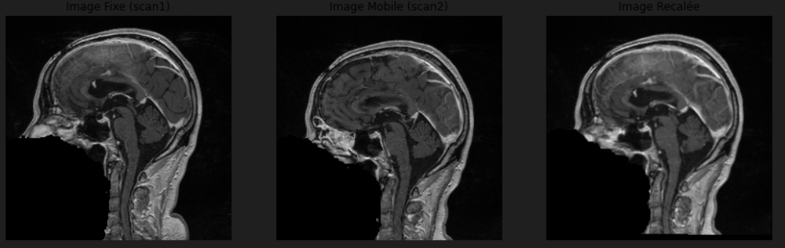

# Projet VTK/ITK
# Mini projet - Etude longitudinale de l’évolution d’une tumeur
## Auteurs
- Kael Facon (kael.facon@epita.fr)
- Samuel Gonçalves (samuel.goncalves@epita.fr)
- Oscar Morand (oscar.morand@epita.fr)

## Bibliothèques utilisées
- `itk (5.4.0)`
- `vtk (9.3.0)`
- `numpy (1.26.4)`
- `skimage (0.18.3)`
- `json (2.0.9)`

## Lecture des données
La lecture des données est réalisée de façon classique via `itk.imread`. Les valeurs des voxels sont ensuite converties en `itk.F` pour permettre l'utilisation d'algorithmes pré-définis.

## Recalage d'images
Différentes techniques de recalage ont été testés:
- Recalage par Translation (`notebooks/TranslationRecalage.ipynb`): la plus simple, et qui de facon innatendu a été la seule a avoir fonctionnée. Ne donne pas des résultats parfait puisqu'elle ne permet que d'effectuer une opération de translation sur notre image pour la recaler mais on estime que ce sera suffisant dans notre étude.

- Recalage Rigide (`notebooks/RigidRecalage.ipynb`): n'est pas sensé être compliqué puisque n'ajoute qu'une rotation à la transformation effectuée, et peut potentiellement donner de meilleurs résultats, cependant lors de nos tests, la valeur de la métrique était inférieur à celle du recalage par translation. De plus ce type de recalage prend plus de temps d'exécution.

- Recalage Affine (`notebooks/AffineRecalage.ipynb`): Le résultat du recalage présente des déformations qui détruisent totalement l'image, malgré tous les tests et tentatives d'optimisations des paramètres.

- Recalage par BSpline (`notebooks/BSplineRecalage.ipynb`): Cette fois le résultat n'est pas inexploitable, cependant le recalage se fait mal et l'image recalée est pire que l'image d'origine, de plus cette technique peut prendre beaucoup de temps.  

Au final, nous avons donc choisit d'intégrer le recalage par translation à notre pipeline finale. Cette étape est totalement automatique et ne cécessite pas d'inputs utilisateurs, cependant, comme c'est un problème d'optimisation, il peut prendre un peu de temps (entre 30s et 1min).

## Segmentation des tumeurs
La segmentation des tumeurs est réalisée via une méthode semi-automatique. Pour chaque tumeur :
- Un point (illustré en vert clair) est considéré comme faisant partie de la tumeur, et est donné à l'algorithme via ses coordonnées.
  
- Ces coordonnées sont utilisées pour détecter les hyperintensitées formant une composante connexe comportant ce point (autrement dit, la tumeur) via `itk.ConnectedThresholdImageFilter`.
  
- Un filtre de diffusion anisotrope est appliqué sur le scan d'entrée via `itk.GradientAnisotropicDiffusionImageFilter` afin d'éviter que la composante connexe représentant la tumeur ne s'agrège à d'autres composantes dont l'intensité est également importante.
  

## Analyse des changements
Pour l'analyse des changements, on calcule plusieurs métriques que l'on enregistre dans le fichier `results.json`. 
- Le champ `scan1_tumors_volume` correspond au volume total des tumeurs détectées par la segmentation pour le scan numéro 1.
- Le champ `scan2_tumors_volume` correspond au volume total des tumeurs détectées par la segmentation pour la scan numéro 2.
- Le champ `tumors_volume_evolution` correspond à l'évolution en pourcentage de volume des tumeurs entre le scan 1 et 2. 
- Le champ `centroids_evolution` correspond au déplacement en pixels du centroide de chaque tumeur détectée par la segmentation entre le scan 1 et 2. Si None est présente dans ce champ, alors cela signifie que le nombre de tumeurs détectées n'est pas le même entre les deux scans.

## Visualisation des changements
Pour la visualisation final des tumeurs le premier scan est utilisé pour placé le contexte du reste de la tête. Par la suite les segmentations des tumeurs sont affichées.
La segmentation du premier scan apparaît en bleu foncé et par dessus la segmentation du deuxième scan apparaît en vert clair.
   |  |  | 

# Temps d'exécution
Le temps d'exécution global de ce projet pour arriver jusqu'à la visualisation est estimé à 3 minutes 30 secondes.
